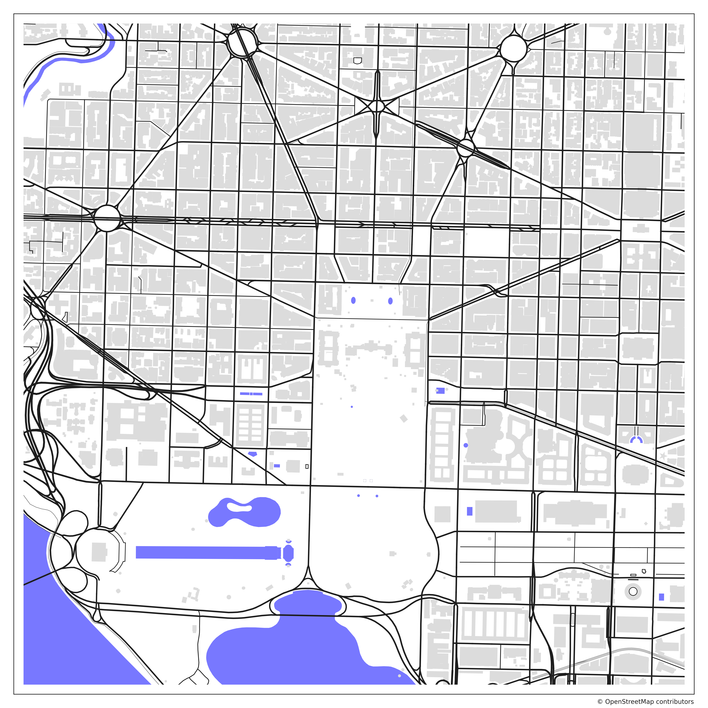
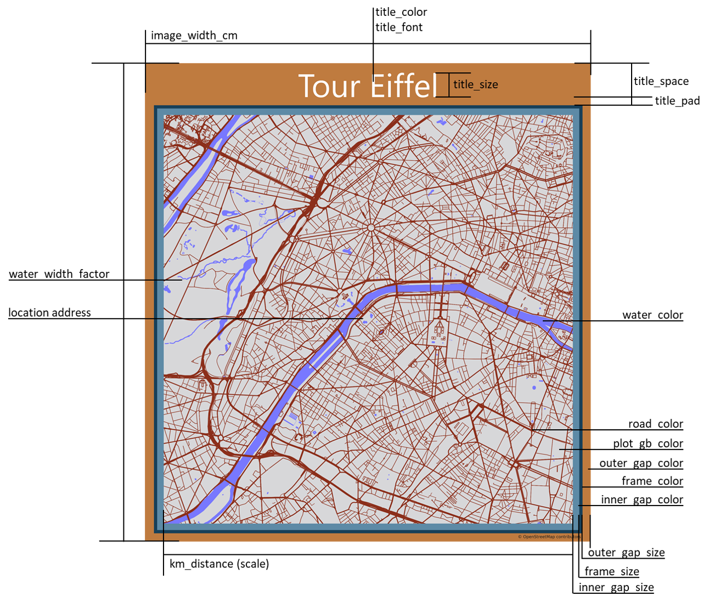

# City Plots from OSM 
This tool creates beautiful city street plots as png-files for any given address.

* [`geopy`](https://geopy.readthedocs.io/): Converts the address to a location
* [`overpy`](https://pypi.org/project/overpy/): Uses the [Overpass-Turbo](https://overpass-turbo.eu/) API to load the city data from [OpenStreetMap](https://www.openstreetmap.org) ([OSM-License](https://www.openstreetmap.org/copyright/en))
* [`utm`](https://pypi.org/project/utm/): Converts the wgs84 coordinates to utm coordinates
* [`matplotlib`](https://matplotlib.org/): Plots the utm coordinates

## How to use
### Location
Edit the `locations` dict in `custom_params` and insert the locations you want to have in the center:
 
`custom_params = {'locations': [{'name': 'Your_Location_Name', 'address': 'Your_Location_Address'}]}`

### Style
You can add further parameters to `custom_params` in order to overwrite the default values.  
E.g. to plot the roads in red and set the size to 3 km by 3 km add: 

`'road_color': rgb(255, 0, 0),`  
`'km_distance_east': 3,`  
`'km_distance_north': 3`

Have a look at the [parameter description](#parameter-description) and `params_l1-3` to see what parameters exist.         
### Hide 
Use the `hide` list to specify elements you do not want to plot.  
E.g. to hide buildings, subway, tram and service-roads use:   
`hide = ['buildings', 'subway', 'tram', 'service']`  

'buildings', 'water', 'rails' and 'roads' can be used to hide all elements of its kind. If you want to be more specific use the OSM-tags such as 'subway', 'tram' and 'service'. 

## Example

_Img 1: Random address in London_

_Img 2: The City Plot (including buildings) of Washington D.C. with the Oval Office in its center_

## Data Limitations
Be aware and grateful that the [OSM-data](https://www.openstreetmap.org) and the [Overpass-Turbo](https://overpass-turbo.eu/) API is free of charge. 
This is only possible due to donation. So if you become a heavy user you should consider supporting them: [OSM-Donation](https://wiki.openstreetmap.org/wiki/Donations)

Too many or too large queries to the Overpass-Turbo API will get blocked. As a reasonable size I suggest approx. 8x8 km areas without buildings and 3x3 km areas with buildings. However, this varies greatly depending on the data-density in that area.  

If you intend to produce plots of a much greater area you should consider getting your data via [Planet-OSM](https://wiki.openstreetmap.org/wiki/Planet.osm).

## Parameter Description
You can change several style parameters regarding color, size, thickness and title. The following image should help you to find the parameters you want to tune. 

_Img 3: Description of the Style Parameter_

## Requirements
The code was tested with Python 3.6, newer versions should also work. The code was tested for compliance with Windows machines. Use the provided [`requirements.txt`](requirements.txt) in the root directory of this repository, in order to install all required modules.  

`pip3 install -r /path/to/requirements.txt`. 
